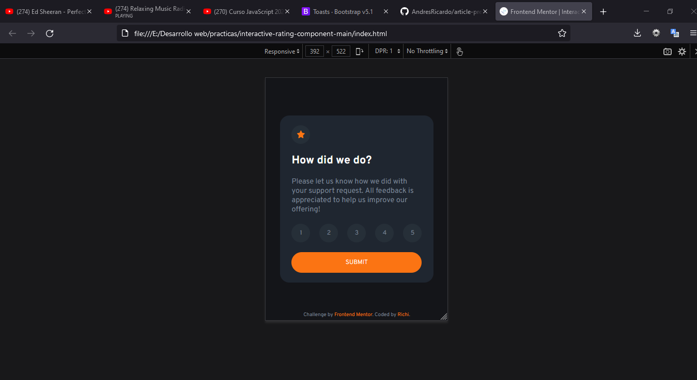
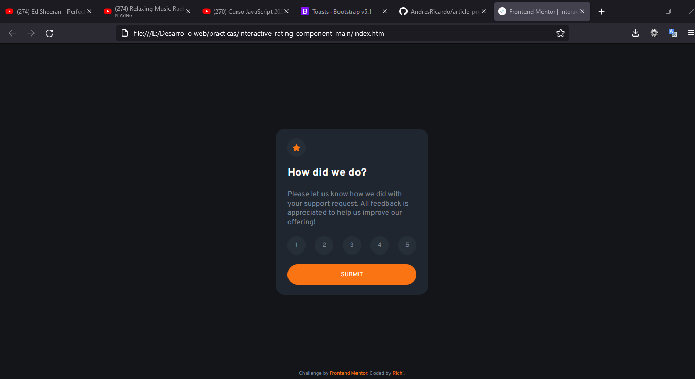

# Frontend Mentor - Interactive rating component solution

This is a solution to the [Interactive rating component challenge on Frontend Mentor](https://www.frontendmentor.io/challenges/interactive-rating-component-koxpeBUmI). Frontend Mentor challenges help you improve your coding skills by building realistic projects.

## Table of contents

-   [Overview](#overview)
    -   [The challenge](#the-challenge)
    -   [Screenshot](#screenshot)
    -   [Links](#links)
-   [My process](#my-process)
    -   [Built with](#built-with)
    -   [What I learned](#what-i-learned)
    -   [Continued development](#continued-development)
    -   [Useful resources](#useful-resources)
-   [Author](#author)
-   [Acknowledgments](#acknowledgments)

## Overview

This challenge was made using just HTML, CSS (SASS, Flexbox and Grid) and for second time JavaScrip.

### The challenge

Users should be able to:

-   View the optimal layout for the app depending on their device's screen size
-   See hover states for all interactive elements on the page
-   Select and submit a number rating
-   See the "Thank you" card state after submitting a rating

### Screenshot





### Links

-   Solution URL: [Github repository](https://github.com/AndresRicardo/interactive-rating-component-main)
-   Live Site URL: [Github page](https://andresricardo.github.io/interactive-rating-component-main/)

## My process

Until now i am just learning web development, by now i just know some of html, css (flexbox and grid included), sass and Javascript, not css frameworks, not css post-processores, not Js frameworks.

### Built with

-   Semantic HTML5 markup
-   CSS custom properties
-   Css Flexbox
-   Css Grid
-   Css pre-processor sass
-   JavaScrip
-   Mobile-first workflow

### What I learned

doing this challenge i learned basics of DOM manage with JavaScritp and eventListeners

```javascript
const ratingCard = document.getElementById("ratingCard");
const ratingScale = document.getElementById("ratingScale");
const buttonSubmit = document.getElementById("buttonSubmit");
const thankyouCard = document.getElementById("thankyouCard");
const selection = document.getElementById("selection");

let rate = {
    value: 0,
};

document.addEventListener("click", (event) => {
    if (
        event.target.classList.value.search("ratingValue") !== -1 &&
        event.target.dataset.value !== undefined
    ) {
        rate.value = event.target.dataset.value;
    } else if (event.target.id === "buttonSubmit" && rate.value !== 0) {
        selection.textContent = `You selected ${rate.value} out of 5`;
        ratingCard.style.display = "none";
        thankyouCard.style.display = "flex";
    } else {
        rate.value = 0;
    }
});
```

### Continued development

Even if to me is more complex design mobile first, i preffer to continue develop of this way.
By now in short time, my next skills to develop are deeping in javascript and start with angular, css post-processors (postcss), typescript.

### Useful resources

-   [Developer mozilla](https://developer.mozilla.org/es/docs/Web/CSS/) - This helped me like general reference.

## Author

-   Website - [Richi](https://github.com/AndresRicardo)
-   Frontend Mentor - [@AndresRicardo](https://www.frontendmentor.io/profile/AndresRicardo)

## Acknowledgments

To my mom and dad jajajajja.
